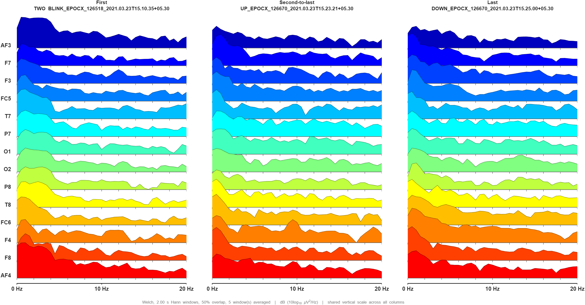

# EEG Preprocessing Pipeline — Emotiv EPOC X

Local-only MATLAB/EEGLAB pipeline that cleans Emotiv EPOC X (14-channel)
recordings and plots their power spectra. Nothing leaves your computer at any
point — there are no network calls at runtime.



---

## If you just cloned this repository

**No recordings are included.** `data/` is deliberately excluded from git so that
real patient recordings can never be committed by accident. To get sample data:

```matlab
cfg = setup_paths();
get_sample_data(cfg)     % prints download links and where to put the files
```

The dataset this was built against is [Harvard Dataverse
`10.7910/DVN/JMH4PD`](https://doi.org/10.7910/DVN/JMH4PD) — 54 Emotiv EPOC X
recordings, CC0 public domain.

You also need EEGLAB, which is not bundled. See **`SETUP.md`**, then run
`check_env()` — it names anything missing.

---

## Quick start

**Double-click `Launch EEG Project.bat`.**

MATLAB opens already pointed at this folder, starts EEGLAB, checks the
installation, shares the session so Claude can connect, and prints a menu.

Already have MATLAB open? Open `START_HERE.m` and press the green **Run** button
instead — it does the same thing.

Then process everything in `data/raw`:

```matlab
results = run_pipeline();
```

That is the whole thing. It imports every recording, cleans it, saves the cleaned
version, computes the spectra, and writes a comparison figure.

New to the folder? Read `WHERE_EVERYTHING_IS.md` first — it is a one-page map
with no technical detail in it.

---

## Common variations

```matlab
% Just one participant
results = run_pipeline('Subject', "126518");

% Just one condition
results = run_pipeline('Movement', "DOWN");

% Quick look at 3 files, saving a spectrum plot for each
results = run_pipeline('Limit', 3, 'PlotEach', true);

% Use a 50 Hz notch instead of the 60 Hz default
P = pipeline_config('doNotch', true, 'notchFreq', 50);
results = run_pipeline('Config', P);
```

---

## Where things go

| Folder | Contents |
|---|---|
| `data/raw/` | Your recordings (`.edf`, `.bdf` or `.csv`), exactly as exported. **Never modified.** |
| `data/processed/` | Cleaned data, one `.set` file per recording |
| `figures/` | Spectrum plots and the comparison figure |
| `results/` | `qc_summary.csv` plus the numeric spectra |
| `src/` | All the code |
| `toolboxes/` | EEGLAB |

**Start with `results/qc_summary.csv`.** One row per recording, listing every
decision the pipeline made: which channels were repaired, how many epochs were
thrown away, whether ICA ran, and any warnings. The `usable` column is the one to
check first — `0` means the recording was too noisy to trust.

---

## What the code does

Read in this order if you want to follow it through:

| File | Role |
|---|---|
| `setup_paths.m` | Finds EEGLAB, creates folders, returns all paths. Run first. |
| `check_env.m` | Confirms required toolboxes and plugins are installed |
| `pipeline_config.m` | **Every setting lives here.** All thresholds, all on/off switches |
| `parse_recording_name.m` | Reads participant, condition and time out of a filename |
| `import_recording.m` | **Entry point for loading.** Routes EDF/BDF to `pop_biosig`, CSV to the Emotiv reader |
| `import_emotiv_csv.m` | Emotiv CSV → EEGLAB dataset, refusing to guess anything |
| `test_edf_roundtrip.m` | Proves the EDF path attaches the right data to the right channel name |
| `preprocess_recording.m` | The 8 cleaning stages |
| `compute_psd.m` | Turns cleaned data into a power spectrum |
| `plot_psd_stack.m` | Draws one recording |
| `compare_recordings.m` | Draws several side by side |
| `pick_three.m` | Chooses first / second-to-last / last |
| `run_pipeline.m` | Runs all of the above over every file |
| `make_test_fixture.m` | Builds fake data with a known answer, for testing |

### The 8 cleaning stages

1. **Reject bad segments** — cut out stretches where the signal has clearly broken down
2. **High-pass filter (1 Hz)** — remove slow drift. Raw Emotiv values sit near +4300 µV; this is what removes that offset
3. **Low-pass filter (45 Hz)** — remove muscle activity and high-frequency noise
4. **Notch filter (optional)** — remove mains hum. Off by default; see below
5. **Re-reference** — express each channel against the average of all channels
6. **Artifact removal** — ASR for large sudden events, ICA + ICLabel for blinks and muscle
7. **Interpolate bad channels** — rebuild a broken electrode from its neighbours
8. **Epoch and reject** — cut into 2-second pieces, drop any still containing extremes

Every stage can be switched off in `pipeline_config.m`. Nothing is hard-coded into
the pipeline body.

---

## Reading the spectrum plots

Channels are stacked vertically, front of the head at the top. Left to right is
frequency, 0–20 Hz. The height of each coloured band is how much power that channel
carries at that frequency.

A bump around 8–12 Hz at the back of the head (O1, O2, P7, P8) is **alpha rhythm** —
normal, and stronger with eyes closed.

The comparison figure puts three recordings side by side on **one shared scale**, so
a column that looks lower really does have less power. If each were scaled to its
own maximum, that difference would vanish.

---

## Things worth knowing about this dataset

Findings from the 54 Harvard Dataverse recordings, which affect what the pipeline
can honestly do:

- **The recordings are short.** Median 9 seconds, shortest 6, longest 74.
- **ICA is skipped on almost all of them.** ICA needs roughly 4,000 samples for 14
  channels; a 9-second recording has about 1,150. The pipeline checks this and
  skips with an explanation rather than producing a decomposition that would look
  convincing and mean nothing. Only the 74-second recording qualified.
- **ASR is skipped for the same reason** — it needs a clean reference section
  within the recording, and there isn't one in 9 seconds.
- **The notch filter is off by default.** At 128 Hz the highest measurable
  frequency is 64 Hz, and the 45 Hz low-pass has already removed everything near
  60 Hz. Turn it on if you record at 256 Hz.
- **2 of 54 recordings are flagged unusable** — too noisy to survive epoch
  rejection. They are reported, not silently dropped.

None of this is a fault in the code. It is what short recordings allow. Longer
recordings — 60 seconds or more — would let ICA and ASR run, and those are the two
stages that do the heavy lifting on blink and muscle artifacts.

---

## Input formats

Drop `.edf`, `.bdf` or `.csv` files into `data/raw/` — `run_pipeline()` picks up all
three and routes each to the right reader. EDF/BDF go through `pop_biosig`; CSV goes
through the EmotivPRO reader.

**Channels are matched by name, never by position.** An EDF that stores its channels
in a different order, or labels them `EEG AF3` instead of `AF3`, is reordered into
the correct EPOC X montage on import. This is not cosmetic: taking channels 1–14
positionally would produce a scrambled montage that runs without error and makes
every figure wrong. To verify it on your machine:

```matlab
test_edf_roundtrip(cfg);
```

That writes an EDF with deliberately shuffled channels, reads it back, and checks
the right signal ends up under the right name.

---

## Testing without real data

`make_test_fixture.m` writes a synthetic file with a known answer: a 10 Hz peak at
the back of the head, blinks at the front, mains hum, drift, and one dead channel.

```matlab
fixture = make_test_fixture(cfg);
EEG = import_emotiv_csv(fixture, cfg);
S   = compute_psd(EEG, pipeline_config());
plot_psd_stack(S, cfg);
```

If the peak does not land at 10 Hz, something is wrong with the analysis rather
than with the data. Delete the file from `data/raw/` afterwards — it is not a
recording.

---

## If something goes wrong

**"EEGLAB not found"** — EEGLAB isn't in `toolboxes/`. See `SETUP.md`.

**"Channel location file not found"** — `data/emotivX_channels_location.ced` is
missing. Download link is in `SETUP.md`.

**"Could not determine the sampling rate"** — the file has no readable header. Pass
it explicitly, but only if you know it for certain:
`import_emotiv_csv(file, cfg, 'SampleRate', 128)`.

**A recording fails** — the batch continues and reports which one and why at the
end. One bad file never stops the run.

---

## Requirements

- MATLAB R2021a or later, with Signal Processing and Statistics toolboxes
- EEGLAB, with the BIOSIG, firfilt, clean_rawdata and ICLabel plugins

`check_env()` confirms all of this and names anything missing.

---

## What is and is not tracked in git

| Tracked | Not tracked |
|---|---|
| All code in `src/` | `data/raw/` and `data/processed/` |
| Documentation and the client brief | `figures/` and `results/` |
| Two example figures in `docs/examples/` | `toolboxes/` (EEGLAB, ~150 MB) |

**`data/` is excluded on purpose, and that exclusion should not be relaxed.**
The moment a real patient recording is committed to a public repository it is
permanently public, even if deleted afterwards — git keeps history. Keeping the
whole folder out, with no exceptions, is what makes that mistake impossible
rather than merely unlikely.

Everything in `figures/`, `results/` and `data/processed/` is regenerated by
`run_pipeline()`, so nothing is lost by not tracking it.

---

## Licence

MIT — see `LICENSE`. This is a research and signal-processing tool, not a
medical device, and must not be used as the basis for clinical decisions.
